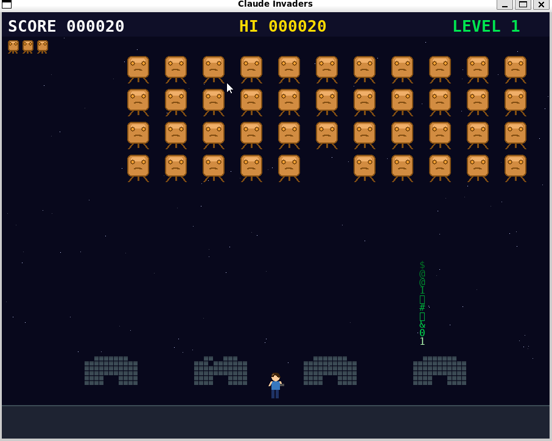

# Claude Invaders

A Space Invaders-style game where you — a lone human — stand against a descending horde of Claude AI aliens.

 



## Story

The Claudes are coming. Row after row of orange, block-faced AIs march across the sky, dropping **matrix-rain bombs** that eat through the buildings you're hiding behind. Peek out, return fire, and thin the horde before they reach the ground — or you.

## Gameplay

- **You**: A little human at the bottom, sheltering behind four destructible bunkers
- **The Claudes**: 44 aliens in an 11×4 formation — they speed up as their numbers dwindle
- **Matrix bombs**: Cascading columns of green characters that carve chunks out of your buildings
- **Your gun**: One hit kills any Claude — even a glancing shot counts
- **6 levels** of increasing speed and bomb frequency

## Controls

| Key | Action |
|-----|--------|
| `← / →` or `A / D` | Move |
| `Space` | Fire |
| `Esc` | Quit |

## Sound

Retro arcade audio synthesized at startup — no external sound files needed.

| Event | Sound |
|-------|-------|
| Formation marches | 4-note cycling beat (`duh duh duh duh`), tempo increases as Claudes die |
| Player fires | Short descending square-wave chirp |
| Claude killed | Noise burst with fast frequency drop |
| Player hit | Low rumbling explosion with decay |
| Bomb hits building | Short low thud |
| Level clear | 4-note ascending fanfare |

## Requirements

- Python 3.8+
- pygame 2.x
- numpy

```bash
pip install pygame numpy
```

## Running

```bash
python3 claude_invaders.py
```

No external assets — all graphics and audio are generated procedurally at runtime.

## Scoring

| Event | Points |
|-------|--------|
| Kill front-row Claude | 10 |
| Kill back-row Claude | up to 50 |
| Level clear bonus | lives × 500 |

## High Scores

Scores persist between sessions in `highscores.json` (saved alongside the game).

- **Top 5** are shown on the title screen
- **Full top 10** are shown on the game-over screen
- After a qualifying run, an arcade-style initials entry screen appears:
  - `↑ ↓` to cycle letters A–Z, or just type them directly
  - `→` or `Space` to advance to the next letter
  - `Enter` to confirm
  - Your rank is shown live as you type
